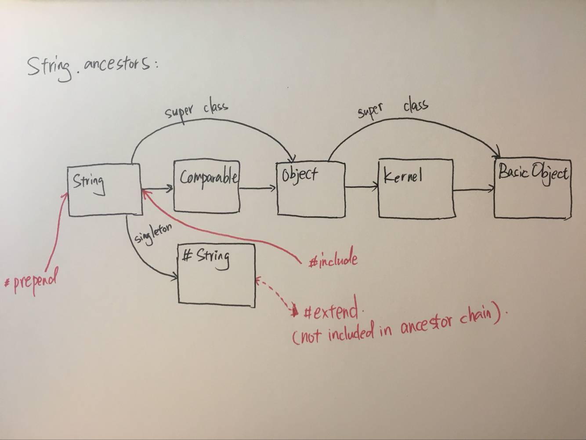

# Include vs. Prepend vs. Extend

三个关键字均用于：包含方法。但具体的含义却不太一样。一图以蔽之：



大致可以解读为：

- `prepend` 会在查找自身方法前，被检索到。也就是会覆盖自己的方法。
- `include` 是在之后。
- `extend` 是在给单件类扩展，也就是说，`extend` 扩展的是类方法。

## include 顺序

`include` 可以理解为链表的头部插入，比如下面这段代码以及他的祖先链：

```ruby
module MyModule
	include A
	include B
	include C
end


MyModule.ancestors # => MyModule → C → B → A
```

## 同时扩展类方法与实例方法

这个操作在 Rails 中很常见。由之前的描述可知：`include` 扩展实例方法，`extend` 扩展类方法。

```ruby
module A
	def a; puts "module A method"; end
end

module B
	def b; puts "module B method"; end
end

class MyClass
	include A
	extend B
end

class OurClass
	class << self
		include B
	end
end

MyClass.new.a
MyClass.b

OurClass.b
```

如果想要将 `A` 扩展到实例方法，需要用 `include A`；而类方法，则需要放到另外一个 `ModuleB` 中来处理。是否有可能，在一个 `Moudle` 中，即完成扩展指定的实例方法，又能扩展类方法呢？废话...

**方案是，利用钩子方法，在 `included` 的时候将类方法也添加进来。**

```ruby
module A
	# 钩子方法，在自己被 include 之后调用
	# @params base [Module] 调用 include 的类，如 MyClass
	def self.included(base)
		# 将定义在 ClassMethod 中的方法扩展为调用类的类方法
		base.extend ClassMethod
	end

	# 没有在 ClassMethod 中的方法，因为是 include，所以扩展为实例方法
	def a; puts "a"; end

	module ClassMethod
		def b; puts "b"; end
	end
end

class MyClass
	include A
end

MyClass.new.a
MyClass.b

```

这部分可以参考 *ActiveRecord* 的 `Validations` 模块。