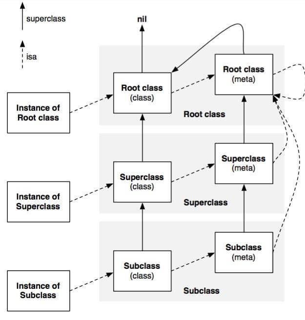

# 元类

虽然 OC 的对象模型也离不开 class 和 meta class，但是 Ruby 中的 meta class 还是有些许不同。

## OC 对象模型

放一张都看过的图：

实例方法列表存储在 `obj.isa` 指针指向的 `obj` 的 Class 中，而类方法列表则是存储在 `obj.isa.isa` 也就是类的 Meta Class 中。

方法查找的时候，`obj.aMethod` 会先向右，再向上（按照《Ruby 元编程》的描述方式来说），也就是到实例的 Class 中进行查找，然后再查找继承链。

到了顶级节点，也就是 `NSObject`，

## Ruby 对象模型

